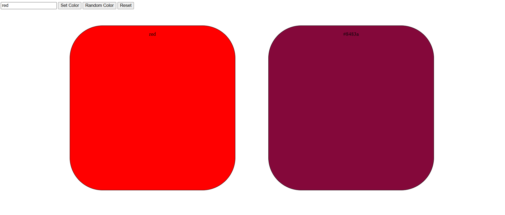

<h1 align="center">Javascript DOM</h1>

  <h3>
    <a href="https://ande-glitch.github.io/RandomColor/">
      Link to project
    </a>
  </h3>

<!-- TABLE OF CONTENTS -->

## Table of Contents

- [Overview](#overview)
- [Built With](#built-with)
- [Features](#features)
- [How to use](#how-to-use)
- [Contact](#contact)

<!-- OVERVIEW -->
## Overview
Javascript orientated website with features in relation to the javascript DOM model

## Features
- Javascript orientated website with event listeners that activate color filling onto the boxes

## How To Use

- Click on the buttons / enter a prompt to change the style of the website 

## Contact
- GitHub [Ande-Glitch](https://github.com/Ande-glitch)
- Epost [And Nguyen](mailto:andynuwen@gmail.com)

## Result

